# Conception d'une Base de Données pour un Site de Paris Sportifs de Football

## Conception du Modèle de Données
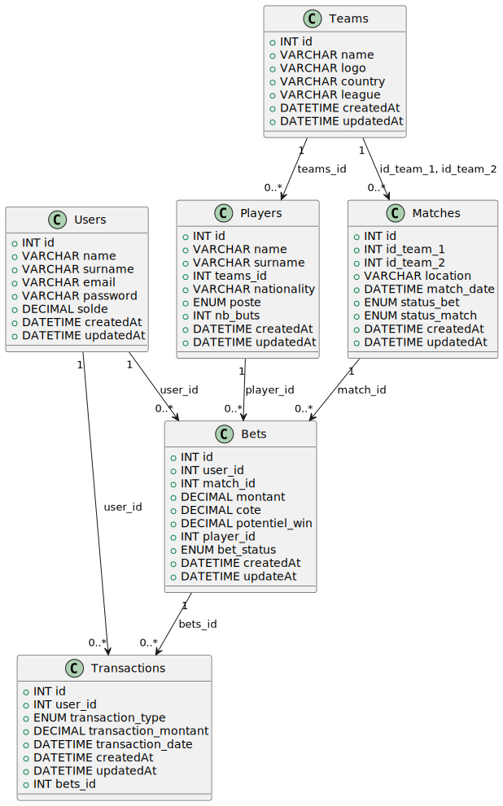

## 1. Afficher les 5 derniers paris placés par un utilisateur

```sql
SELECT u.name, u.surname, b.montant, b.potentiel_win
FROM bets b
    JOIN users u ON b.user_id = u.id
WHERE
    b.user_id = 6
ORDER BY b.createdAt DESC
LIMIT 5;
```

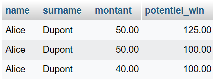


## 2.Lister tous les joueurs, leur position et l'équipe dans laquelle ils jouent

```sql
SELECT p.name, p.surname, p.poste, t.name AS team_name
FROM players p
    JOIN teams t ON p.teams_id = t.id;
```

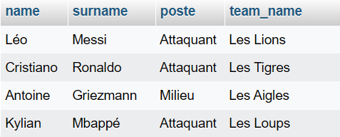

## 3.Calculer le nombre total de paris placés sur chaque match

```sql
SELECT
    t1.name AS equipe1,
    t2.name AS equipe2,
    COUNT(b.id) AS total_paris
FROM
    bets b
    JOIN matches m ON b.match_id = m.id
    JOIN teams t1 ON m.id_team_1 = t1.id
    JOIN teams t2 ON m.id_team_2 = t2.id
GROUP BY
    m.id;
```

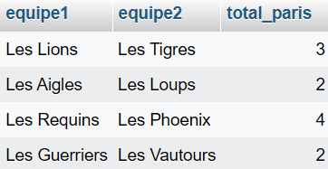

## 4. Afficher les utilisateurs qui n'ont jamais placé de pari

```sql
SELECT u.name, u.surname
FROM users u
    LEFT JOIN bets b ON u.id = b.user_id
WHERE
    b.user_id IS NULL;
```

[Pas de données pour l'image]()

## 5. Lister les matchs qui se sont terminés par une victoire de l'équipe A

Ajout de la colonne match_result

```sql
ALTER TABLE matches
ADD COLUMN match_result ENUM(
    'Équipe A',
    'Équipe B',
    'Match nul'
) DEFAULT NULL;
```

Mettre à jour des matchs avec "Équipe A" comme gagnante

```sql
UPDATE matches SET match_result = 'Équipe A' WHERE id IN (16, 17);
```

Mettre à jour un match avec "Équipe B" comme gagnante

```sql
UPDATE matches SET match_result = 'Équipe B' WHERE id = 19;
```

### Victoire de l'équipe A

```sql
SELECT
    team_a.name AS victoire_equipe_A,
    team_b.name AS defaite_equipe_B,
    matches.match_date,
    matches.location
FROM
    matches
    JOIN teams AS team_a ON matches.id_team_1 = team_a.id
    JOIN teams AS team_b ON matches.id_team_2 = team_b.id
WHERE
    matches.match_result = 'Équipe A';
```

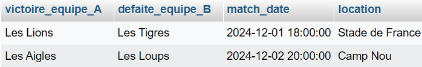

## 6. Afficher les utilisateurs ayant un solde supérieur à 100€

```sql
SELECT name, surname FROM users WHERE solde > 100;
```

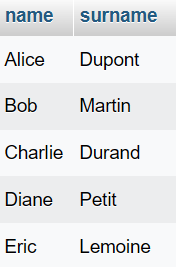

## 7. Afficher le total des paris gagnés et perdus par un utilisateur spécifique

```sql
SELECT users.name AS nom, users.surname AS prénom, COUNT(*) AS total_bets
FROM bets
    JOIN users ON users.id = bets.user_id
WHERE
    user_id = 6
GROUP BY
    bet_status;
```

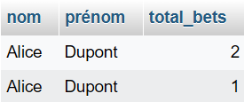

## 8. Lister les équipes avec le nombre de victoires qu'elles ont eues

```sql
SELECT teams.name AS equipe, COUNT(matches.id) AS nombre_victoires
FROM teams
    JOIN matches ON (
        teams.id = matches.id_team_1
        AND matches.match_result = 'Équipe A'
    )
    OR (
        teams.id = matches.id_team_2
        AND matches.match_result = 'Équipe B'
    )
GROUP BY
    teams.name
ORDER BY nombre_victoires DESC;
```

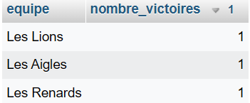

## 9. Lister les matchs sur lesquels un utilisateur a parié et le statut de chaque pari

```sql
SELECT
    team1.name AS equipe_A,
    team2.name AS equipe_B,
    bets.montant AS montant_parie,
    bets.cote AS prediction,
    bets.bet_status AS statut_pari
FROM
    bets
    JOIN matches ON bets.match_id = matches.id
    JOIN teams AS team1 ON matches.id_team_1 = team1.id
    JOIN teams AS team2 ON matches.id_team_2 = team2.id
WHERE
    bets.user_id = 6
ORDER BY bets.createdAt DESC;
```

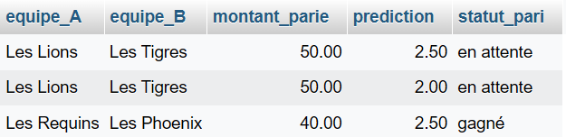

## 10. Afficher le montant total des transactions (dépôts et retraits) pour chaque utilisateur

```sql
SELECT
    users.name AS nom,
    users.surname AS prénom,
    SUM(
        CASE
            WHEN transaction_type = 'dépôt' THEN transaction_montant
            ELSE 0
        END
    ) AS total_depots,
    SUM(
        CASE
            WHEN transaction_type = 'retrait' THEN transaction_montant
            ELSE 0
        END
    ) AS total_retraits
FROM transactions
    JOIN users ON users.id = transactions.user_id
GROUP BY
    user_id;
```

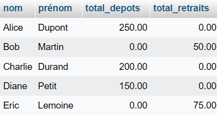

## 11. Ajouter un dépôt pour un utilisateur

```sql
INSERT INTO
    transactions (
        user_id,
        transaction_type,
        transaction_montant,
        transaction_date
    )
VALUES (6, 'dépôt', 150, NOW());
```

[Pas de données à afficher]()

## 12. Placer un pari sur un match pour une équipe

```sql
INSERT INTO
    bets (
        user_id,
        match_id,
        montant,
        cote,
        player_id,
        bet_status
    )
VALUES (
        6,
        16,
        50,
        2.5,
        173,
        'en attente'
    );
```

[Pas de données à afficher]()

## 13. Afficher tous les matchs programmés d'une équipe

```sql
SELECT * FROM matches WHERE id_team_1 = 11 OR id_team_2 = 11;
```

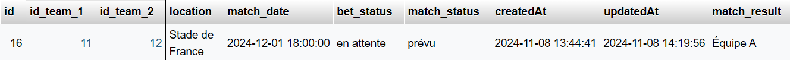

## 14. Afficher les paris en attente pour un utilisateur

```sql
SELECT users.name, users.surname, b.montant, b.cote, b.bet_status, t1.name AS team_1, t2.name AS team_2
FROM
    bets b
    JOIN matches m ON b.match_id = m.id
    JOIN teams t1 ON m.id_team_1 = t1.id
    JOIN teams t2 ON m.id_team_2 = t2.id
    JOIN users ON b.user_id = users.id
WHERE
    b.user_id = 6
    AND b.bet_status = 'en attente';
```

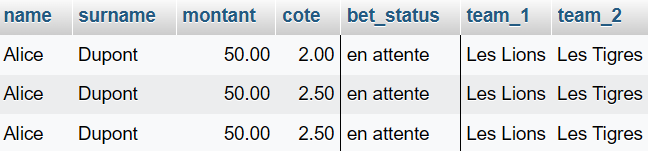

## 15. Mettre à jour le statut d'un pari en "won" avec le montant gagné

```sql
UPDATE bets SET bet_status = 'gagné', cote = 2.5 WHERE id = 26;
```

[Pas de données à afficher]()

## 16. Afficher les joueurs d'une équipe spécifique

```sql
SELECT p.name, p.surname, p.poste, t.name AS team_name
FROM players p
    JOIN teams t ON p.teams_id = t.id
WHERE
    t.id = 11;
```

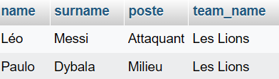

## 17. Lister les équipes avec leur nombre de joueurs

```sql
SELECT t.id, t.name, COUNT(p.id) AS nombre_joueurs
FROM teams t
    JOIN players p ON t.id = p.teams_id
GROUP BY
    t.id;
```

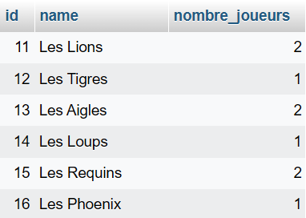

## 18. Calculer le total des paris placés par les utilisateurs pour chaque match

```sql
SELECT
    m.id
    t1.name AS équipe_1,
    t2.name AS équipe_2,
    SUM(b.montant) AS total_pari
FROM
    bets b
    JOIN matches m ON b.match_id = m.id
    JOIN teams t1 ON m.id_team_1 = t1.id
    JOIN teams t2 ON m.id_team_2 = t2.id
GROUP BY
    m.id;
```

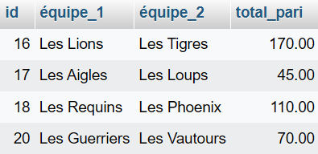

## 19. Lister les utilisateurs ayant gagné un pari récemment

```sql
SELECT DISTINCT
    u.id,
    u.name,
    u.surname
FROM bets b
    JOIN users u ON b.user_id = u.id
WHERE
    b.bet_status = 'gagné'
    AND b.createdAt >= CURDATE() - INTERVAL 30 DAY;
```

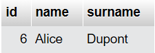

## 20. Afficher le solde des utilisateurs et le total de leurs gains

```sql
SELECT u.id, u.name, u.surname, u.solde, SUM(b.montant * b.cote) AS total_gains
FROM users u
    LEFT JOIN bets b ON u.id = b.user_id
    AND b.bet_status = 'gagné'
GROUP BY
    u.id;
```

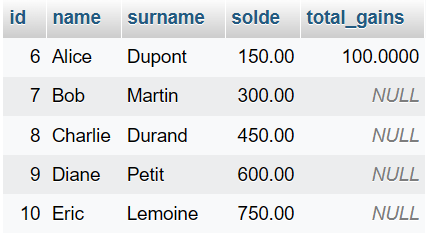
